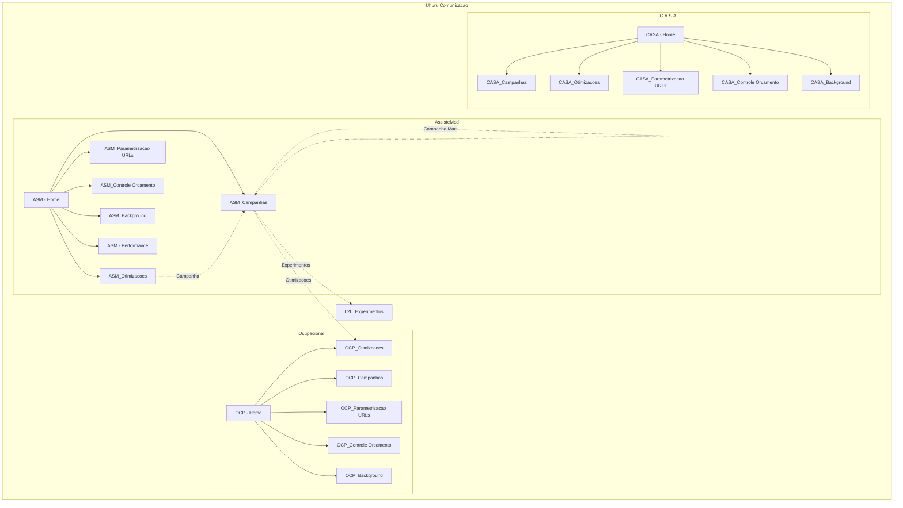

# Mapeamento Completo - Notion Uhuru Comunicacao

Data: 2026-02-20
Metodo: Playwright MCP + CDP via Comet Browser

---

## Estrutura Hierarquica

### ASM - AssisteMed
```
ASM - AssisteMed
|-- Links Externos
|   |-- Google Ads (ads.google.com)
|   |-- Meta Ads (adsmanager.facebook.com)
|
|-- Relatorios
|   |-- ASM - Acompanhamento performance
|   |-- Looker Studio (OCP :: Campanha Comercial)
|
|-- Dia a Dia
|   |-- ASM_Campanhas
|   |   |-- View: Galeria (cards)
|   |   |-- View: Tabela (linhas)
|   |   |-- Propriedades:
|   |   |   |-- Campanha mae [text]
|   |   |   |-- Campanha por canal [text]
|   |   |   |-- Mes [select]
|   |   |   |-- Investimento [number - R$]
|   |   |   |-- Canal [select: Meta Ads, Google Ads, LinkedIn]
|   |   |   |-- Objetivo [select: Geracao de Leads, Awareness, Trafego]
|   |   |   |-- Inicio [date]
|   |   |   |-- Termino [date]
|   |   |   |-- Experimentos [RELATION -> L2L_Experimento]
|   |   |   |-- Qt. de Otimizacoes [ROLLUP]
|   |   |   |-- Otimizacoes [RELATION -> OCP_Otimizacoes]
|   |   |   |-- Valor Gasto [number/rollup]
|   |   |   |-- Saldo [formula]
|   |   |   |-- Orcamento Diario [formula]
|   |   |   |-- Dias Restantes [formula]
|   |   |   |-- Dias Passados [formula]
|   |   |   |-- % [number]
|   |   |   |-- Formula % [formula]
|   |   |   |-- Proj. de Verba [formula]
|   |
|   |-- ASM_Otimizacoes
|   |   |-- View: Nome da Campanha (Lista)
|   |   |-- Propriedades:
|   |   |   |-- O que? [text]
|   |   |   |-- Data de Execucao [date]
|   |   |   |-- Campanha Mae [relation]
|   |   |   |-- Campanha [relation]
|   |   |   |-- Otimizacao [text]
|   |   |   |-- Canal [select: Meta Ads, Google Ads, LinkedIn]
|   |   |   |-- Status [select]
|   |   |   |-- Objetivo da Campanha [select]
|   |   |   |-- Responsavel [person]
|   |
|   |-- ASM_Parametrizacao de URLs
|   |-- ASM_Controle de Orcamento
|
|-- Sistema
|   |-- ASM_Background
|       |-- ASM_Visao Geral
|       |-- ASM_Campanhas por Canal
|
|-- Databases na Pagina Principal
    |-- Resumo [database]
    |-- Experimentos [kanban: Backlog -> Na fila -> Em andamento -> Em Analise -> Concluido]
    |-- Campanhas [timeline]
```

### OCP - Ocupacional
```
OCP - Ocupacional
|-- Links Externos
|   |-- Google Ads
|   |-- Meta Ads
|   |-- LinkedIn Ads
|
|-- Relatorios
|   |-- OCP - Acompanhamento performance
|
|-- Dia a Dia
|   |-- OCP_Campanhas
|   |-- OCP_Otimizacoes
|   |-- OCP_Parametrizacao de URLs
|   |-- OCP_Controle de Orcamento
|
|-- Sistema
|   |-- OCP_Background
```

### CASA - C.A.S.A.
```
CASA - C.A.S.A.
|-- Links Externos
|   |-- Google Ads
|   |-- Meta Ads
|
|-- Relatorios
|   |-- CASA - Acompanhamento performance
|
|-- Dia a Dia
|   |-- CASA_Campanhas
|   |-- CASA_Otimizacoes
|   |-- CASA_Parametrizacao de URLs
|   |-- CASA_Controle de Orcamento
|
|-- Sistema
|   |-- CASA_Background
```

---

## Relations Identificadas

| Database | Propriedade | Tipo | Target Database |
|----------|-------------|------|-----------------|
| ASM_Campanhas | Experimentos | Relation (bidirecional) | L2L_Experimento |
| ASM_Campanhas | Otimizacoes | Relation (bidirecional) | OCP_Otimizacoes |
| ASM_Campanhas | Campanha Mae | Relation | ASM_Campanhas (self) |
| ASM_Otimizacoes | Campanha Mae | Relation | ASM_Campanhas |
| ASM_Otimizacoes | Campanha | Relation | ASM_Campanhas |

---

## Rollups Identificados

| Database | Propriedade | Origem |
|----------|-------------|--------|
| ASM_Campanhas | Qt. de Otimizacoes | Count de Otimizacoes relacionadas |

---

## Formulas Identificadas

| Database | Propriedade | Funcao |
|----------|-------------|--------|
| ASM_Campanhas | Saldo | Investimento - Valor Gasto |
| ASM_Campanhas | Orcamento Diario | Calculo baseado em dias |
| ASM_Campanhas | Dias Restantes | Termino - Hoje |
| ASM_Campanhas | Dias Passados | Hoje - Inicio |
| ASM_Campanhas | Formula % | Percentual de execucao |
| ASM_Campanhas | Proj. de Verba | Projecao de gasto |

---

## Views por Database

### ASM_Campanhas
- Galeria (cards com preview)
- Tabela (lista detalhada)

### ASM_Otimizacoes
- Nome da Campanha (lista)

### Home Pages (todas)
- Resumo (database inline)
- Experimentos (kanban)
- Campanhas (timeline)

---

## Diagrama Mermaid



---

## URLs das Databases

### AssisteMed
- Home: `https://www.notion.so/uhuru-comunicacao/AssisteMed-7f240474e6d048109947206900b0312b`
- Campanhas: `https://www.notion.so/uhuru-comunicacao/ASM_Campanhas-5ec08bd220cd432390a6688962565472`
- Otimizacoes: `https://www.notion.so/uhuru-comunicacao/ASM_Otimiza-es-94041a0518d7452aa0d76177c84938c4`
- Parametrizacao: `https://www.notion.so/uhuru-comunicacao/ASM_Parametriza-o-de-URLs-8e81ae57d2324c54b07624b2bebb80cf`
- Controle de Orcamento: `https://www.notion.so/uhuru-comunicacao/ASM_Controle-de-Or-amento-bac0e90c7b4c4bf9a86779767403ed07`
- Background: `https://www.notion.so/uhuru-comunicacao/ASM_Background-601d899d57444dd9bf0e22dfa17a2e99`

### Ocupacional
- Home: `https://www.notion.so/uhuru-comunicacao/Ocupacional-a9adbad0564948369cbbaf0ec544f066`

### C.A.S.A.
- Home: `https://www.notion.so/uhuru-comunicacao/C-A-S-A-1d6dbafb030280c682a2ff8c758db28b`

---

## Padrao de Nomenclatura

| Prefixo | Cliente | Plataformas |
|---------|---------|-------------|
| OCP_ | Ocupacional | Meta Ads, Google Ads, LinkedIn Ads |
| ASM_ | AssisteMed | Meta Ads, Google Ads |
| CASA_ | C.A.S.A. | Meta Ads |

---

## Notas Tecnicas

1. **Fonte de Dados ASM_Campanhas**: `ASM_Campanhas_por_Canal_Background`
2. **Relations bidirecionais**: Todas as relations identificadas sao bidirecionais
3. **Views inline**: As home pages contem databases inline (Resumo, Experimentos, Campanhas)
4. **Kanban de Experimentos**: Fluxo padrao `Backlog -> Na fila -> Em andamento -> Em Analise -> Concluido`

---

*Gerado automaticamente via Playwright MCP em 2026-02-20*
