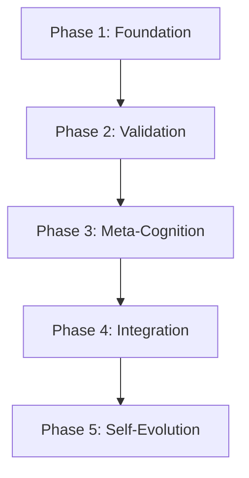

# Epic: Clone Lab v2.0 - Self-Evolving Architecture

**Epic ID:** EPIC-CLONE-LAB-V2
**Version:** 1.0
**Date:** 2026-02-20
**Author:** Morgan (PM), Orion (AIOS Master)
**Status:** Approved

---

## Executive Summary

Transformar o Clone Lab de um pipeline técnico estático para uma plataforma auto-evolutiva com capacidades de meta-cognição, inspirado pelo Pipeline Alan Nicolas v4.0 e alinhado com a filosofia AIOS de auto-melhoria.

### Business Value

| Métrica | v1.0 Baseline | v2.0 Target | Impact |
|---------|---------------|-------------|--------|
| Clone Fidelity | 65% | 85% | +31% |
| Validation Coverage | 1 score | 63 tasks | 63x |
| Self-Improvements/mês | 0 | 5+ | ∞ |
| Human Quality Gates | 0 | 6 | 6 |

---

## Scope

### In Scope
- 8 Analytical Minds com personas especializadas
- 63 Validation Tasks em 7 categorias
- 6 Human Checkpoints no pipeline
- Meta-Cognition Layer (auto-avaliação, auto-melhoria)
- Process Evolution Tracking (audit, rollback)
- Integração com pipeline v1.0 existente

### Out of Scope
- Web UI (Phase 2 futura)
- Mobile apps
- Multi-tenant features
- Paid tier features

---

## Architecture Reference

- **PRD:** `docs/prd/prd.md`
- **Architecture v2.0:** `docs/architecture/clone-lab-v2-architecture.md`
- **ADRs:**
  - ADR-006: Mind-Based Architecture
  - ADR-007: 63 Validation Tasks System
  - ADR-008: 6 Human Checkpoints
  - ADR-009: Meta-Cognition Layer
  - ADR-010: Process Evolution Tracking

---

## Phases & Stories

### Phase 1: Foundation (Sprint 1-2)

**Goal:** Estabelecer a base com 8 Minds e Orchestrator

| Story ID | Title | Est. Points |
|----------|-------|-------------|
| CL2-001 | IMind Interface & Base Types | 3 |
| CL2-002 | Tim Mind - Extraction Specialist | 5 |
| CL2-003 | Daniel Mind - Behavioral Patterns | 5 |
| CL2-004 | Brene Mind - Values & Beliefs | 5 |
| CL2-005 | Barbara Mind - Cognitive Architecture | 5 |
| CL2-006 | Charlie Mind - Synthesis & Paradoxes | 5 |
| CL2-007 | Constantin Mind - Implementation | 5 |
| CL2-008 | Quinn Mind - Quality Assurance | 5 |
| CL2-009 | Victoria Mind - Feasibility | 5 |
| CL2-010 | Mind Orchestrator & Router | 8 |
| CL2-011 | Mind Package Setup & Exports | 2 |

**Phase Total:** 53 points

---

### Phase 2: Validation (Sprint 3-4)

**Goal:** Implementar 63 Tasks e 6 Checkpoints

| Story ID | Title | Est. Points |
|----------|-------|-------------|
| CL2-012 | Validation Task Interface | 3 |
| CL2-013 | Extraction Tasks (EX-001 to EX-010) | 8 |
| CL2-014 | Behavioral Tasks (BH-001 to BH-012) | 8 |
| CL2-015 | Values Tasks (VL-001 to VL-008) | 5 |
| CL2-016 | Cognitive Tasks (CG-001 to CG-011) | 8 |
| CL2-017 | Synthesis Tasks (SY-001 to SY-009) | 5 |
| CL2-018 | Implementation Tasks (IM-001 to IM-007) | 5 |
| CL2-019 | Quality Tasks (QA-001 to QA-006) | 5 |
| CL2-020 | Task Registry & Executor | 5 |
| CL2-021 | Checkpoint Interface & Manager | 5 |
| CL2-022 | CP-1 Source Validation Checkpoint | 3 |
| CL2-023 | CP-2 Analysis Review Checkpoint | 3 |
| CL2-024 | CP-3 DNA Approval Checkpoint | 3 |
| CL2-025 | CP-4 Prompt Testing Checkpoint | 3 |
| CL2-026 | CP-5 Clone Acceptance Checkpoint | 3 |
| CL2-027 | CP-6 Fidelity Confirmation Checkpoint | 3 |

**Phase Total:** 77 points

---

### Phase 3: Meta-Cognition (Sprint 5-6)

**Goal:** Implementar auto-avaliação, constitution e evolution tracking

| Story ID | Title | Est. Points |
|----------|-------|-------------|
| CL2-028 | Meta-Cognition Package Setup | 2 |
| CL2-029 | Metrics Collector | 5 |
| CL2-030 | Self-Assessment Engine | 8 |
| CL2-031 | Bottleneck Detector | 5 |
| CL2-032 | Process Optimizer | 5 |
| CL2-033 | Recommendation Engine | 5 |
| CL2-034 | Constitution Rules Definition | 5 |
| CL2-035 | Constitution Validator & Enforcer | 5 |
| CL2-036 | Auto-Improvement Engine | 8 |
| CL2-037 | Change Applier | 5 |
| CL2-038 | Rollback Manager | 5 |
| CL2-039 | Pattern Learner | 5 |
| CL2-040 | Result Tracker | 3 |
| CL2-041 | Evolution Log System | 5 |
| CL2-042 | Snapshot System | 3 |
| CL2-043 | Monthly Report Generator | 3 |

**Phase Total:** 81 points

---

### Phase 4: Integration (Sprint 7-8)

**Goal:** Integrar com pipeline v1.0 e CLI

| Story ID | Title | Est. Points |
|----------|-------|-------------|
| CL2-044 | Minds to Analyzers Migration | 8 |
| CL2-045 | DNA Synthesizer Enhancement | 5 |
| CL2-046 | Manifest Generator Enhancement | 5 |
| CL2-047 | CLI Checkpoint Commands | 5 |
| CL2-048 | CLI Evolution Commands | 5 |
| CL2-049 | CLI Validation Commands | 5 |
| CL2-050 | Pipeline Phase Hooks | 5 |
| CL2-051 | Shared Context System | 5 |
| CL2-052 | Handoff Protocol | 3 |
| CL2-053 | Progress Reporting | 3 |
| CL2-054 | Error Recovery Integration | 5 |

**Phase Total:** 54 points

---

### Phase 5: Self-Evolution (Sprint 9-10)

**Goal:** Ativar auto-evolução e dashboard

| Story ID | Title | Est. Points |
|----------|-------|-------------|
| CL2-055 | Auto-Improvement Scheduler | 5 |
| CL2-056 | Human Approval Workflow | 5 |
| CL2-057 | Impact Measurement System | 5 |
| CL2-058 | Learning Repository | 5 |
| CL2-059 | Constitution Evolution | 5 |
| CL2-060 | Evolution Dashboard (CLI) | 8 |
| CL2-061 | System Health Monitor | 5 |
| CL2-062 | Alert System | 3 |
| CL2-063 | End-to-End Self-Evolution Test | 8 |
| CL2-064 | Documentation Update | 3 |
| CL2-065 | Performance Benchmarking | 5 |

**Phase Total:** 57 points

---

## Total Estimates

| Phase | Stories | Points | Sprints |
|-------|---------|--------|---------|
| Phase 1: Foundation | 11 | 53 | 2 |
| Phase 2: Validation | 16 | 77 | 2 |
| Phase 3: Meta-Cognition | 16 | 81 | 2 |
| Phase 4: Integration | 11 | 54 | 2 |
| Phase 5: Self-Evolution | 11 | 57 | 2 |
| **Total** | **65** | **322** | **10** |

---

## Dependencies

### External Dependencies
- AIOS Framework (já integrado)
- Claude API (já configurado)
- ChromaDB (já instalado)

---

## Risks & Mitigations

| Risk | Probability | Impact | Mitigation |
|------|-------------|--------|------------|
| Complexidade da Meta-Cognition | High | High | Implementar incrementalmente, começar com auto-assessment básico |
| Performance overhead das 63 tasks | Medium | Medium | Execução paralela, cache de resultados |
| Resistência a checkpoints humanos | Medium | Low | Modo auto-aprove para clones de baixo risco |
| Bugs em auto-modificação | High | Critical | Rollback capability, rate limiting, audit trail |

---

## Success Criteria

### Definition of Done (Epic Level)

- [ ] 8 Minds implementados e funcionais
- [ ] 63 Validation Tasks executando
- [ ] 6 Checkpoints integrados no pipeline
- [ ] Meta-Cognition Layer operacional
- [ ] Pelo menos 3 auto-melhorias aplicadas
- [ ] Rollback testado e funcionando
- [ ] Evolution tracking gerando relatórios
- [ ] Fidelidade média de clones >= 80%
- [ ] Documentação atualizada

---

## Stakeholders

| Role | Name | Responsibility |
|------|------|----------------|
| Product Owner | User | Epic approval, checkpoint approvals |
| Architect | Aria | Architecture decisions |
| AIOS Master | Orion | Framework governance |
| Developer | Dex | Implementation |

---

## Change Log

| Date | Version | Description | Author |
|------|---------|-------------|--------|
| 2026-02-20 | 1.0 | Epic created | Morgan (PM) |

---

*Generated by Morgan (PM Agent) - AIOS Framework*
